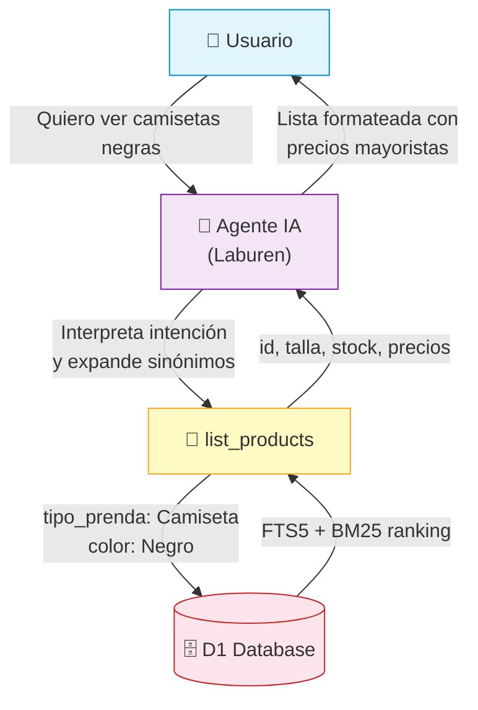
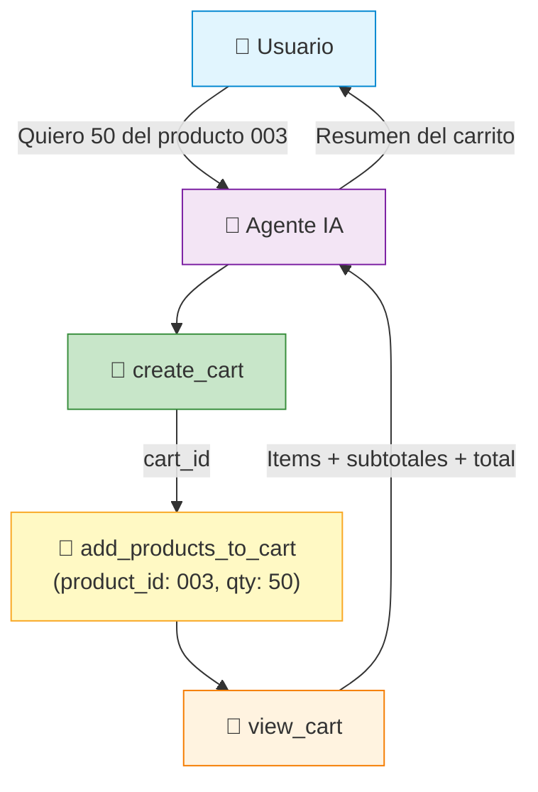
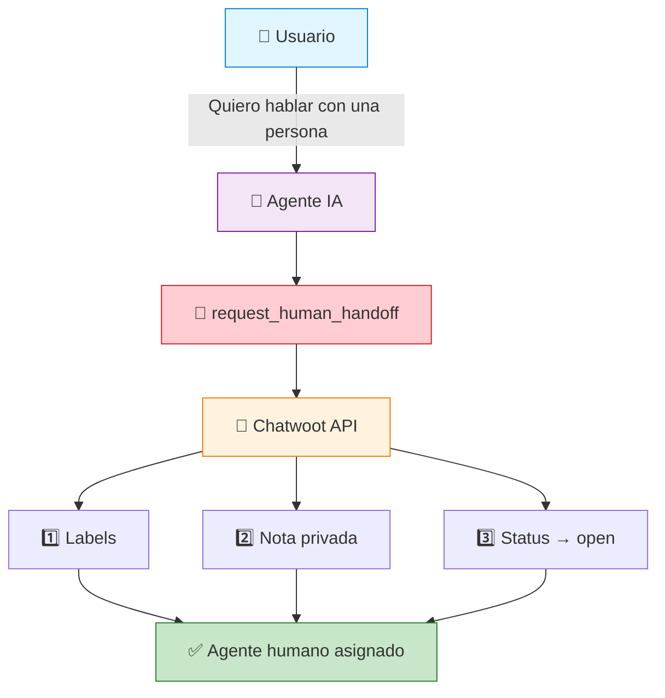

# API — MCP Tools y Endpoints

## Endpoints HTTP

| Endpoint | Método | Descripción |
|----------|--------|-------------|
| `/` | `GET` | Health check → `"Laburen MCP Agent (Active)"` |
| `/sse` | `GET` | Conexión SSE para el protocolo MCP |
| `/message` | `POST` | Recibe mensajes JSON-RPC del cliente MCP |

## MCP Tools

### `list_products`

Busca productos con filtros combinables. Utiliza FTS5 full-text search con ranking BM25.

| Parámetro | Tipo | Requerido | Descripción |
|-----------|------|-----------|-------------|
| `query` | string | No | Búsqueda libre (ej: "camiseta negra deportiva") |
| `tipo_prenda` | enum | No | Pantalón, Camiseta, Falda, Sudadera, Chaqueta, Camisa |
| `categoria` | enum | No | Deportivo, Casual, Formal |
| `talla` | enum | No | S, M, L, XL, XXL |
| `color` | enum | No | Verde, Blanco, Negro, Azul, Rojo, Amarillo, Gris |
| `precio_max` | number | No | Precio máximo por unidad (referencia: precio_50_u) |

---

### `create_cart`

Crea un carrito de compras vinculado a una conversación.

| Parámetro | Tipo | Requerido | Descripción |
|-----------|------|-----------|-------------|
| `conversation_id` | string | Sí | ID de la conversación de Chatwoot |

---

### `add_products_to_cart`

Agrega un producto al carrito o actualiza su cantidad si ya existe.

| Parámetro | Tipo | Requerido | Descripción |
|-----------|------|-----------|-------------|
| `cart_id` | string | Sí | ID del carrito |
| `product_id` | string | Sí | ID del producto a agregar |
| `qty` | number | Sí | Cantidad de unidades |

---

### `delete_product_from_cart`

Elimina un producto del carrito.

| Parámetro | Tipo | Requerido | Descripción |
|-----------|------|-----------|-------------|
| `cart_id` | string | Sí | ID del carrito |
| `product_id` | string | Sí | ID del producto a eliminar |

---

### `view_cart`

Muestra el contenido completo del carrito con subtotales y total.

| Parámetro | Tipo | Requerido | Descripción |
|-----------|------|-----------|-------------|
| `cart_id` | string | Sí | ID del carrito |

---

### `request_human_handoff`

Deriva la conversación a un agente humano a través de la API de Chatwoot.

| Parámetro | Tipo | Requerido | Descripción |
|-----------|------|-----------|-------------|
| `conversation_id` | string | Sí | ID de la conversación |
| `reason` | string | Sí | Motivo de la derivación |
| `summary` | string | Sí | Resumen del contexto para el agente humano |

**Acciones que ejecuta en Chatwoot:**
1. Agrega label `bot-derivacion` a la conversación
2. Crea nota privada con el resumen para el agente
3. Cambia el status a `open` para que aparezca en la cola

---

### `ping`

Health check simple. No requiere parámetros. Retorna `"pong"`.
