```mermaid
flowchart TD
    U["👤 Usuario"] -->|"Quiero 50 del producto 003"| A["🤖 Agente IA"]
    A --> C["🔧 create_cart"]
    C -->|cart_id| ADD["🔧 add_products_to_cart\n(product_id: 003, qty: 50)"]
    ADD --> V["🔧 view_cart"]
    V -->|"Items + subtotales + total"| A
    A -->|"Resumen del carrito"| U

    style U fill:#e1f5fe,stroke:#0288d1
    style A fill:#f3e5f5,stroke:#7b1fa2
    style C fill:#c8e6c9,stroke:#388e3c
    style ADD fill:#fff9c4,stroke:#f9a825
    style V fill:#fff3e0,stroke:#f57c00
```

# API — MCP Tools y Endpoints

## Endpoints HTTP

| Endpoint | Método | Descripción |
|----------|--------|-------------|
| `/` | `GET` | Health check → `"Laburen MCP Agent (Active)"` |
| `/sse` | `GET` | Conexión SSE para el protocolo MCP |
| `/message` | `POST` | Recibe mensajes JSON-RPC del cliente MCP |

## MCP Tools

### `list_products`

Busca productos con filtros combinables. Utiliza FTS5 full-text search con ranking BM25.

| Parámetro | Tipo | Requerido | Descripción |
|-----------|------|-----------|-------------|
| `query` | string | No | Búsqueda libre (ej: "camiseta negra deportiva") |
| `tipo_prenda` | enum | No | Pantalón, Camiseta, Falda, Sudadera, Chaqueta, Camisa |
| `categoria` | enum | No | Deportivo, Casual, Formal |
| `talla` | enum | No | S, M, L, XL, XXL |
| `color` | enum | No | Verde, Blanco, Negro, Azul, Rojo, Amarillo, Gris |
| `precio_max` | number | No | Precio máximo por unidad (referencia: precio_50_u) |

```mermaid
flowchart TD
    U["👤 Usuario"] -->|"Quiero ver camisetas negras"| A["🤖 Agente IA\n(Laburen)"]
    A -->|"Interpreta intención\ny expande sinónimos"| T["🔧 list_products"]
    T -->|"tipo_prenda: Camiseta\ncolor: Negro"| DB[("🗄️ D1 Database")]
    DB -->|"FTS5 + BM25 ranking"| T
    T -->|"id, talla, stock, precios"| A
    A -->|"Lista formateada con\nprecios mayoristas"| U

    style U fill:#e1f5fe,stroke:#0288d1
    style A fill:#f3e5f5,stroke:#7b1fa2
    style T fill:#fff9c4,stroke:#f9a825
    style DB fill:#fce4ec,stroke:#c62828
```

---

### `create_cart`

Crea un carrito de compras vinculado a una conversación.

| Parámetro | Tipo | Requerido | Descripción |
|-----------|------|-----------|-------------|
| `conversation_id` | string | Sí | ID de la conversación de Chatwoot |

---

### `add_products_to_cart`

Agrega un producto al carrito o actualiza su cantidad si ya existe.

| Parámetro | Tipo | Requerido | Descripción |
|-----------|------|-----------|-------------|
| `cart_id` | string | Sí | ID del carrito |
| `product_id` | string | Sí | ID del producto a agregar |
| `qty` | number | Sí | Cantidad de unidades |

---

### `delete_product_from_cart`

Elimina un producto del carrito.

| Parámetro | Tipo | Requerido | Descripción |
|-----------|------|-----------|-------------|
| `cart_id` | string | Sí | ID del carrito |
| `product_id` | string | Sí | ID del producto a eliminar |

---

### `view_cart`

Muestra el contenido completo del carrito con subtotales y total.

| Parámetro | Tipo | Requerido | Descripción |
|-----------|------|-----------|-------------|
| `cart_id` | string | Sí | ID del carrito |

---

### `request_human_handoff`

Deriva la conversación a un agente humano a través de la API de Chatwoot.

| Parámetro | Tipo | Requerido | Descripción |
|-----------|------|-----------|-------------|
| `conversation_id` | string | Sí | ID de la conversación |
| `reason` | string | Sí | Motivo de la derivación |
| `summary` | string | Sí | Resumen del contexto para el agente humano |

**Acciones que ejecuta en Chatwoot:**
1. Agrega label `bot-derivacion` a la conversación
2. Crea nota privada con el resumen para el agente
3. Cambia el status a `open` para que aparezca en la cola

```mermaid
flowchart TD
    U["👤 Usuario"] -->|"Quiero hablar con una persona"| A["🤖 Agente IA"]
    A --> H["🔧 request_human_handoff"]
    H --> CW["💬 Chatwoot API"]
    CW --> L["1️⃣ Labels"]
    CW --> N["2️⃣ Nota privada"]
    CW --> S["3️⃣ Status → open"]
    L & N & S --> R["✅ Agente humano asignado"]

    style U fill:#e1f5fe,stroke:#0288d1
    style A fill:#f3e5f5,stroke:#7b1fa2
    style H fill:#ffcdd2,stroke:#c62828
    style CW fill:#fff3e0,stroke:#f57c00
    style R fill:#c8e6c9,stroke:#2e7d32
```

---

### `ping`

Health check simple. No requiere parámetros. Retorna `"pong"`.
