# Arquitectura del Sistema

## Diagrama General

```mermaid
flowchart LR
    A["👤 Usuario"] -->|WhatsApp| B["📱 WhatsApp\n(Meta)"]
    B -->|Webhook| C["💬 Chatwoot\n(CRM)"]
    C -->|API| D["🤖 Laburen\n(Agente IA)"]
    D -->|MCP Protocol\nSSE + JSON-RPC| E["⚡ MCP Server\n(Cloudflare Workers)"]
    E -->|SQL| F[("🗄️ Cloudflare D1\n(SQLite + FTS5)")]

    style A fill:#e1f5fe,stroke:#0288d1
    style B fill:#c8e6c9,stroke:#388e3c
    style C fill:#fff3e0,stroke:#f57c00
    style D fill:#f3e5f5,stroke:#7b1fa2
    style E fill:#fff9c4,stroke:#f9a825
    style F fill:#fce4ec,stroke:#c62828
```

## Clean Architecture

El proyecto sigue los principios de Clean Architecture con tres capas:

```mermaid
flowchart TD
    subgraph Domain["🟢 Domain Layer"]
        E1["Product entity"]
        E2["Cart entity"]
        R1["IProductRepository"]
        R2["ICartRepository"]
    end

    subgraph Application["🔵 Application Layer"]
        UC1["ListProducts"]
        UC2["GetProductDetails"]
        UC3["CreateCart"]
        UC4["AddToCart"]
        UC5["RemoveFromCart"]
        UC6["ViewCart"]
    end

    subgraph Infrastructure["🔴 Infrastructure Layer"]
        DB1["D1ProductRepository"]
        DB2["D1CartRepository"]
        MCP["MCP Tools"]
        DI["DI Container"]
    end

    Application --> Domain
    Infrastructure --> Domain
    Infrastructure --> Application

    style Domain fill:#e8f5e9,stroke:#388e3c
    style Application fill:#e3f2fd,stroke:#1976d2
    style Infrastructure fill:#fce4ec,stroke:#c62828
```

### Principios aplicados

- **Dependency Inversion:** Las capas superiores no dependen de las inferiores. Domain define interfaces, Infrastructure las implementa.
- **Single Responsibility:** Cada use case tiene una sola responsabilidad.
- **Separation of Concerns:** MCP tools en infraestructura, lógica en aplicación, contratos en dominio.

## Modelo de Base de Datos

## Protocolo MCP — Flujo de Conexión SSE

```mermaid
sequenceDiagram
    participant Client as 🤖 Cliente MCP
    participant Worker as ⚡ Cloudflare Worker
    participant DO as 🔄 Durable Object
    participant DB as 🗄️ D1 Database

    Client->>Worker: GET /sse
    Worker->>DO: Forward request
    DO->>DO: Crear sessionId + Transport
    DO-->>Client: SSE stream abierto
    DO-->>Client: event: endpoint<br/>data: /messages?sessionId=xxx

    Client->>Worker: POST /messages?sessionId=xxx<br/>{"method": "tools/call", "params": {"name": "list_products"}}
    Worker->>DO: Forward message
    DO->>DB: FTS5 query con BM25 ranking
    DB-->>DO: Resultados
    DO-->>Client: SSE event con resultados JSON
```

## Durable Objects

Cada conexión SSE crea una instancia independiente de `McpServer` dentro del Durable Object `LaburenMCP`. Esto permite:

- **Aislamiento de sesiones**: Cada agente conectado tiene su propio estado
- **Persistencia**: El Durable Object mantiene la conexión SSE activa
- **Escalabilidad**: Cloudflare distribuye automáticamente las instancias
