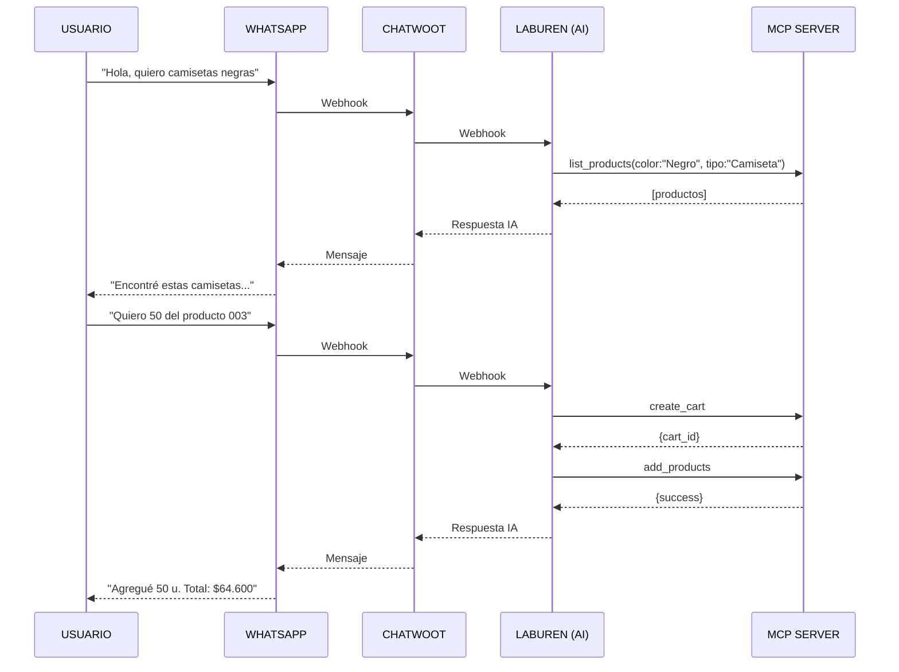
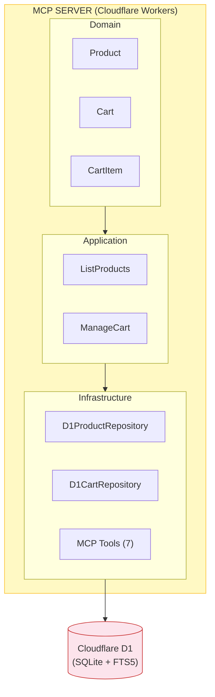

# Laburen Challenge - MCP Server para Agente de Ventas Mayorista

**Autor:** Felipe Andreau  
**Repositorio:** https://github.com/FelipeAndreau/laburen-challenge-ai-agent  
**Endpoint MCP:** https://laburen-asistente-ventas-mcp-server.feliandreau.workers.dev/sse

---

## Endpoints MCP (7 Tools)

| Tool | Descripción | Parámetros |
|------|-------------|------------|
| `ping` | Health check del servidor | ninguno |
| `list_products` | Busca productos con filtros y FTS5 | `query?`, `tipo_prenda?`, `categoria?`, `talla?`, `color?`, `precio_max?`, `volume?` |
| `create_cart` | Crea un carrito nuevo | `conversation_id` (string, requerido) |
| `add_products_to_cart` | Agrega productos al carrito | `cart_id`, `product_id`, `quantity`, `volume` (50/100/200) |
| `delete_product_from_cart` | Elimina producto del carrito | `cart_id`, `product_id` |
| `view_cart` | Muestra contenido del carrito | `cart_id` |
| `request_human_handoff` | Deriva conversación a humano | `conversation_id`, `reason?` |

### Ejemplo de uso - `list_products`
```json
{
  "tipo_prenda": "Camiseta",
  "color": "Negro",
  "talla": "L",
  "volume": 50
}
```
**Respuesta:** Lista de productos con id, descripción, stock y precio para el volumen solicitado.

---

## Diagrama de Flujo de Interacción del Agente



---

## Arquitectura del Sistema



---

## Stack Tecnológico

| Componente | Tecnología |
|------------|------------|
| Runtime | Cloudflare Workers |
| Base de datos | Cloudflare D1 (SQLite) con FTS5 |
| Protocolo | MCP (Model Context Protocol) via SSE |
| Lenguaje | TypeScript |
| Arquitectura | Clean Architecture (Domain/Application/Infrastructure) |
| CRM | Chatwoot |
| Agente IA | Laburen (GPT-5-mini) |
| Canal | WhatsApp Business API (Meta) |

---

## Catálogo de Productos

- **Tipos:** Pantalón, Camiseta, Falda, Sudadera, Chaqueta, Camisa
- **Categorías:** Deportivo, Casual, Formal
- **Tallas:** S, M, L, XL, XXL
- **Colores:** Verde, Blanco, Negro, Azul, Rojo, Amarillo, Gris
- **Volúmenes:** 50, 100, 200 unidades (precios diferenciados)
- **Total:** 100 productos precargados
